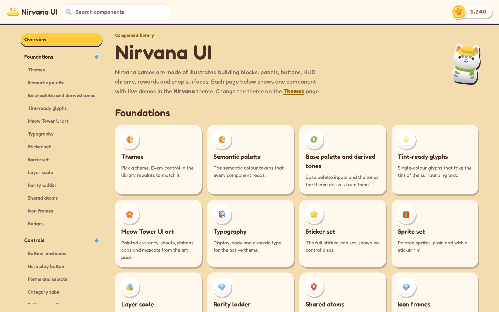
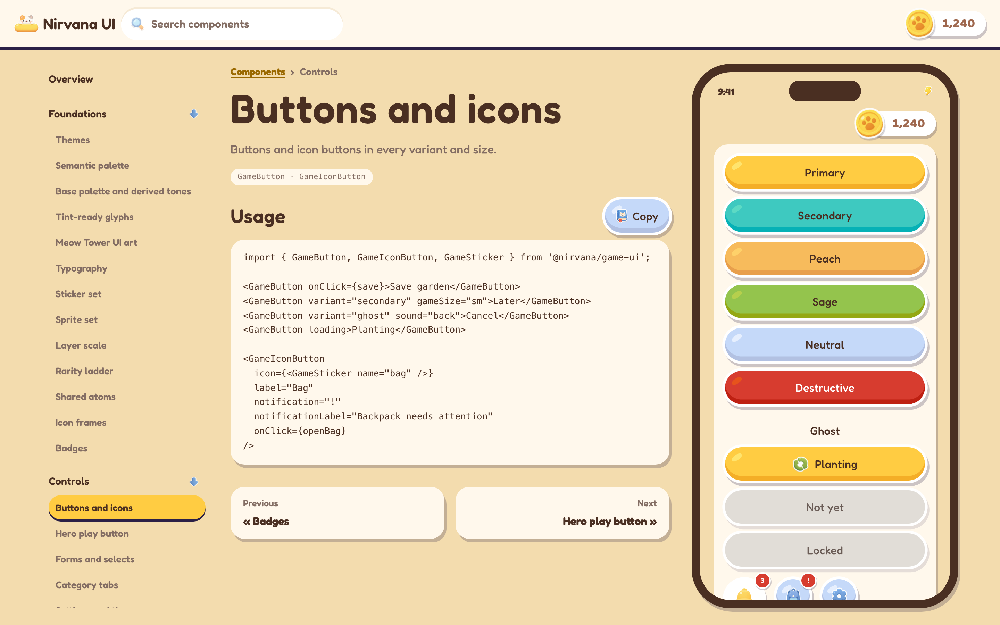
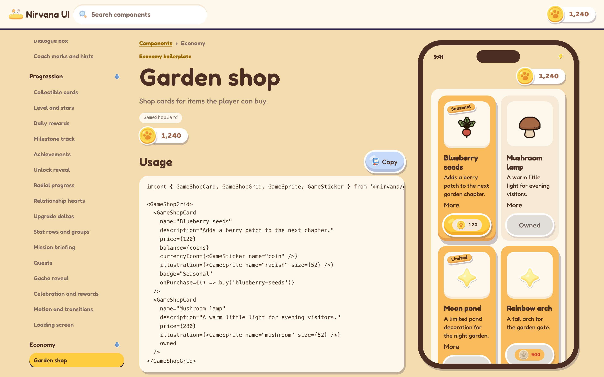
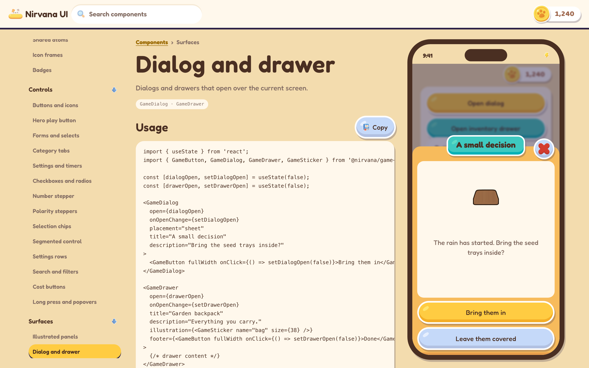
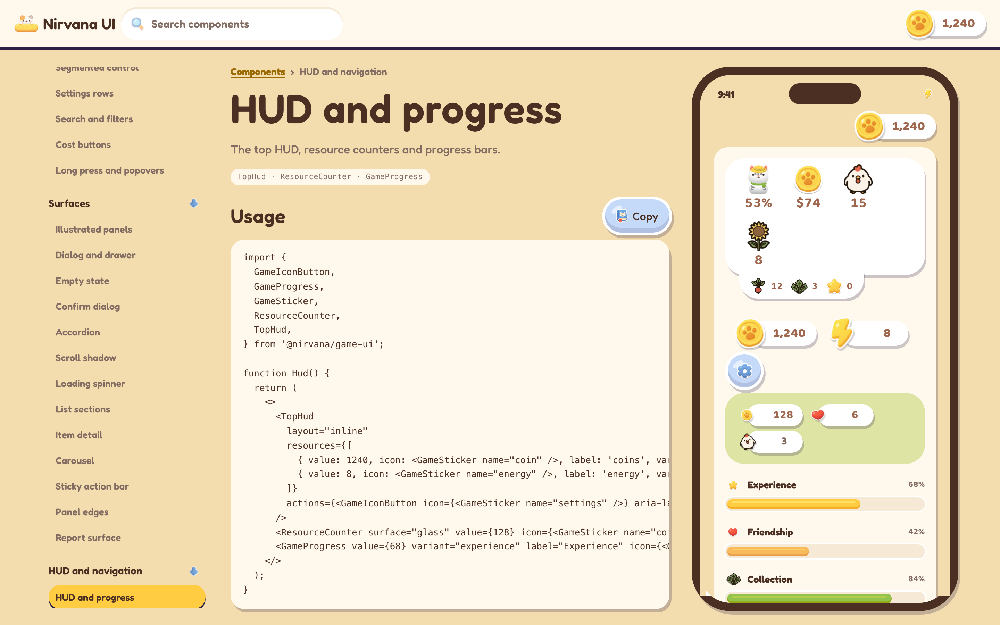
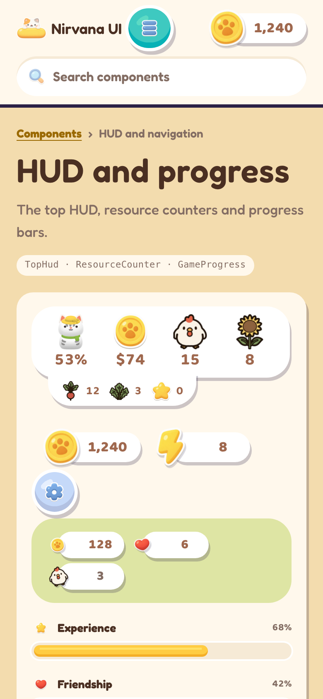
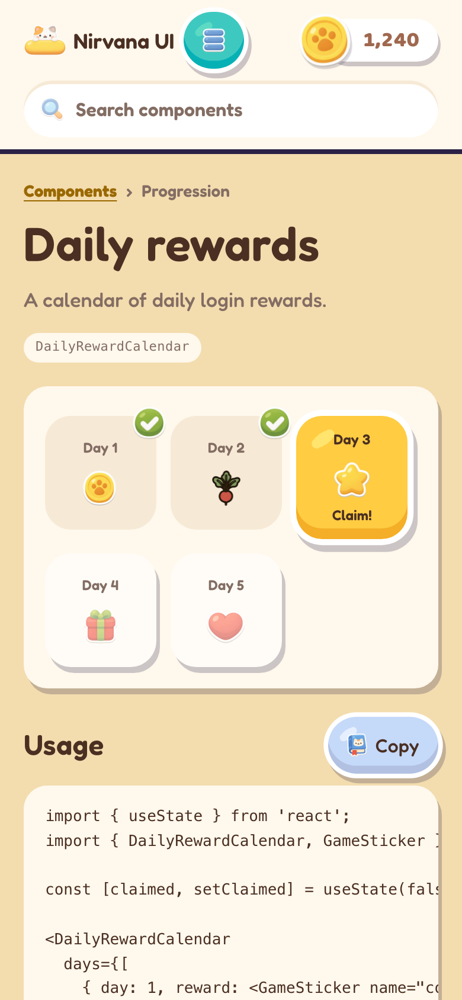

# Nirvana UI

An illustrated, cozy game UI component library for React. The components are
made for UI-heavy mobile games: panels, buttons, HUD counters, rewards, shops
and dialogs, all drawn in one hand-painted style.

**Live demo:** https://wynlo.github.io/nirvana-ui/



## Features

- 75 components in seven groups: Foundations, Controls, Surfaces, HUD and
  navigation, Characters, Progression and Economy.
- Themes. Every component reads its colours, type and art from the active
  theme. The Themes page switches between them.
- Live demos. Each component page runs its demo in a phone frame at mobile
  size.
- Usage samples. Each component page has a code sample with a Copy button.

## Screenshots

| | |
| --- | --- |
|  |  |
| Buttons and icon buttons in every variant | Shop cards with prices, badges and owned states |
|  |  |
| A dialog open over the demo screen | Top HUD, resource counters and progress bars |

On a phone, each page shows its demo at full width:

| | |
| --- | --- |
|  |  |
| HUD and progress | Daily rewards calendar |

## Usage

Each component page in the live demo shows the component's props in use. This
is the sample from the Buttons and icons page:

```tsx
import { GameButton, GameIconButton, GameSticker } from '@nirvana/game-ui';

<GameButton onClick={save}>Save garden</GameButton>
<GameButton variant="secondary" gameSize="sm">Later</GameButton>
<GameButton variant="ghost" sound="back">Cancel</GameButton>
<GameButton loading>Planting</GameButton>

<GameIconButton
  icon={<GameSticker name="bag" />}
  label="Bag"
  notification="!"
  notificationLabel="Backpack needs attention"
  onClick={openBag}
/>
```

## Project layout

| Path | Contents |
| --- | --- |
| `site/` | The built component library that GitHub Pages serves. Generated, do not edit. |
| `docs/screenshots/` | The screenshots in this README. |
| `.github/workflows/pages.yml` | Publishes `site/` to GitHub Pages on every push to `main`. |
